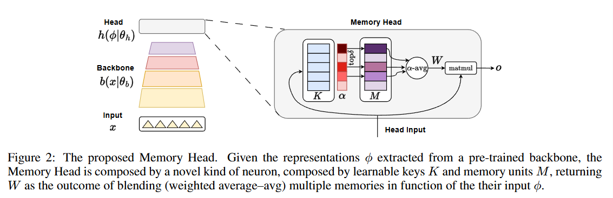
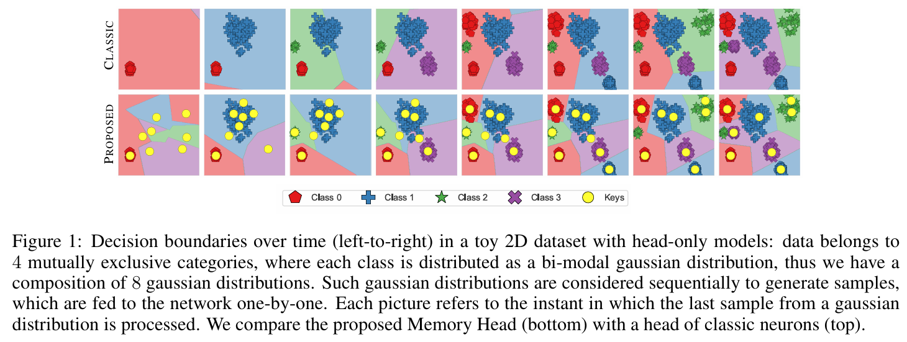

  
  

  <h1>Memory Head for Pre-Trained Backbones in Continual Learning</h1>
  

  

      Matteo Tiezzi &emsp; Federico Becattini &emsp; Simone Marullo &emsp; Stefano Melacci
  

   

This repo contains the PyTorch code for CoLLAs 2024 paper "[Memory Head for Pre-Trained Backbones in Continual Learning](tba)".
You can find in the [`ci` subfolder](https://github.com/sailab-code/memory_head/tree/main/ci) the source code for the class incremental setting (paper Section 4.1), while the [`ocdi` folder](https://github.com/sailab-code/memory_head/tree/main/ocdi) contains the source code for the online class-domain incremental setting (paper Section 4.2). Have a look at the [Colab Notebook](https://github.com/mtiezzi/memory_head/blob/main/mh_example.ipynb) for a complete example on how to define and use the Memory Head!

CODE REPOSITORY CONTENTS
------------------------
Directory tree structure:

    ci :                 folder containing the source code for the class incremental setting (paper Section 4.1)

            mh :                 folder containing the source code of our Memory Heads
            main_wb.py :         experiments runner
            ...                  files from the SLCA repository
    ocdi :               folder containing the source code for the online class-domain incremental setting (paper Section 4.2)
    
            mh :                 folder containing the source code of our mh model
            competitors :                   source folder for the implementation of continual learning baselines and competitors  
            d2d :                   folder containing 2D dataset (MODES in the paper) generators and utils
                check_2d_datasets.py:   file for checking the shapes of the built 2d datasets
                generate_2d_datasets.py:   file for the customizable creation of the 2D datasets
                utils_2d_datasets.py : code utils for handling the 2D datasets 
            datasets :              folder containing the non-stationary imagenet dataset files    
            main.py :             experiments runner

QUICK START: defining a Memory Head (MH)
--------------------------
Have a look at the [Colab Notebook](https://github.com/mtiezzi/memory_head/blob/main/mh_example.ipynb) for a complete example on how to define and use the Memory Head!

We also provide example scripts in the `ocdi/d2d/example_2d_mh.py` path. 

USAGE EXAMPLE
-------------

A very tiny example. If you would create a vanilla Linear layer in PyTorch as follows:

        net = nn.Sequential(
            nn.Linear(in_features=d, out_features=10, bias=True),
            nn.Tanh(),
            nn.Linear(in_features=10, out_features=c, bias=True)
        ).to(device)

Then, you can easily define and use a Memory Head (with the online K-means update procedure described in the main paper, `MH_ok`) as follows:

        net = nn.Sequential(
            nn.Linear(in_features=d, out_features=10, bias=True),
            nn.Tanh(),
            MHLinear(in_features=10, out_features=c, bias=True,
                    key_mem_units=10,
                    upd_m="WTA",  # choices=["vanilla", "WTA"]
                    upd_k="ad_hoc_WTA",  # choices=["ad_hoc_WTA", "grad_WTA", "grad_not_WTA"]
                    beta_k=0.01,
                    gamma_alpha=25.0, tau_alpha=0.95,
                    tau_mu=50,
                    tau_eta=50, scramble=True,
                    delta=2,
                    distance="euclidean",  # choices=["cosine", "euclidean", "dot_scaled"]
                    )
        ).to(device)

